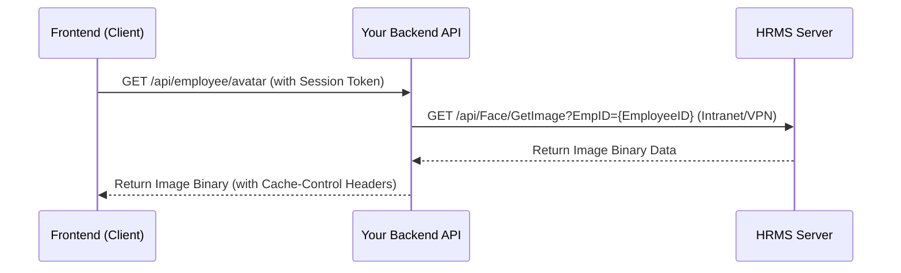

# คู่มือการเชื่อมต่อ HRMS เพื่อแสดงรูปภาพโปรไฟล์พนักงาน (HRMS Image Integration Guide)

คู่มือนี้จัดทำขึ้นเพื่อเป็นแนวทางในการเชื่อมต่อระบบ HRMS เพื่อดึงข้อมูลรูปภาพโปรไฟล์ของพนักงานมาแสดงผลบนระบบอื่น ๆ ในองค์กร โดยให้ความสำคัญกับ **ประสิทธิภาพการทำงาน (Performance)** และ **ความปลอดภัยของข้อมูลส่วนบุคคล (PII Security)** เป็นหลัก

---

## 1. ข้อมูล API ปลายทาง (HRMS API Endpoint)

ระบบ HRMS ให้บริการ API สำหรับดึงรูปภาพใบหน้าของพนักงานโดยใช้ **รหัสพนักงาน (Employee ID)** เป็น Key ในการเรียกค้น เพื่อความปลอดภัยสูงสุดและไม่เปิดเผยข้อมูลส่วนบุคคล (PII) ที่มีความอ่อนไหวสูง เช่น เลขบัตรประจำตัวประชาชน

*   **URL Format:** `https://wms.advanceagro.net/WSVIS/api/Face/GetImage?EmpID={EmployeeID}`
*   **Method:** `GET`
*   **Response:** File stream (รูปภาพโดยตรง เช่น JPEG/PNG)

---

## 2. รูปแบบการสถาปัตยกรรม (Implementation Approach)

### Secure Backend Proxy (แนะนำสำหรับการใช้งานทั่วไป ⭐⭐⭐)
เพื่อป้องกันไม่ให้มีการดึงข้อมูลรูปภาพโดยตรงจากบราวเซอร์ของยูสเซอร์ไปยังเซิร์ฟเวอร์ HRMS หรือเปิดเผยโครงสร้างเครือข่ายภายใน ระบบปลายทางจะต้องสร้าง **Proxy Endpoint** บน Backend ของตัวเองเพื่อทำหน้าที่เป็นตัวกลาง



**ข้อดีของการทำ Backend Proxy:**
1. **Security:** บราวเซอร์ภายนอกไม่เห็น URL ของระบบ HRMS และไม่เห็นข้อมูลของพนักงานท่านอื่น
2. **Caching:** สามารถจัดการ Cache ของรูปภาพได้ที่ฝั่ง Backend ของตัวเอง เพื่อลดโหลดการทำงานและ Bandwidth ของระบบ HRMS
3. **Connectivity:** แก้ไขข้อจำกัดในกรณีที่ระบบ HRMS ทำงานอยู่หลัง Firewall หรือ VPN โดยให้ Backend ทำหน้าที่เชื่อมต่อผ่านเครือข่ายภายในองค์กรแทน

---

## 3. ตัวอย่างการพัฒนาโค้ด (Code Examples)

### 3.1 ตัวอย่าง Backend Proxy (Node.js / Express)

ตัวอย่างโค้ด Backend ในการทำ Proxy ดึงรูปภาพพนักงานโดยอ้างอิงจากข้อมูลผู้ใช้ที่ล็อกอินอยู่ใน Session:

```javascript
const express = require('express');
const axios = require('axios');
const path = require('path');
const fs = require('fs');
const router = express.Router();

router.get('/api/employee/avatar', async (req, res) => {
  try {
    // 1. ตรวจสอบสิทธิ์ผู้ใช้งาน (Authentication)
    if (!req.user || !req.user.employee_code) {
      return res.status(401).json({ error: 'Unauthorized' });
    }

    const employeeId = req.user.employee_code; // ใช้ Employee ID จาก Session

    // 2. เรียกขอรูปภาพจาก HRMS API โดยใช้ Employee ID
    const hrmsUrl = `https://wms.advanceagro.net/WSVIS/api/Face/GetImage?EmpID=${employeeId}`;
    
    const response = await axios({
      method: 'get',
      url: hrmsUrl,
      responseType: 'stream',
      timeout: 5000 // กำหนด timeout 5 วินาทีเพื่อป้องกันการค้างของระบบ
    });

    // 3. ส่ง Headers สำหรับการแคช เพื่อไม่ให้บราวเซอร์ต้องยิงขอรูปภาพบ่อยเกินไป
    res.setHeader('Content-Type', response.headers['content-type'] || 'image/jpeg');
    res.setHeader('Cache-Control', 'public, max-age=86400'); // Cache 1 วัน

    // 4. Pipe ข้อมูลรูปภาพกลับไปให้ Client
    response.data.pipe(res);

  } catch (error) {
    console.error('Failed to fetch avatar from HRMS:', error.message);
    
    // กรณีโหลดไม่สำเร็จ ให้ส่งรูป Default Avatar กลับไปโดยตรงแทนการ Redirect
    const defaultAvatarPath = path.join(__dirname, '../public/images/default-avatar.png');
    
    if (fs.existsSync(defaultAvatarPath)) {
      res.setHeader('Content-Type', 'image/png');
      res.setHeader('Cache-Control', 'public, max-age=3600'); // แคชรูป default 1 ชั่วโมง
      fs.createReadStream(defaultAvatarPath).pipe(res);
    } else {
      res.status(404).json({ error: 'Avatar not found' });
    }
  }
});

module.exports = router;
```

---

### 3.2 ตัวอย่าง Component ฝั่ง Frontend (React + Tailwind CSS)

สร้าง Component สำหรับแสดงรูปโปรไฟล์พนักงานที่รองรับการทำ Lazy Loading และมีระบบ Fallback ในกรณีที่โหลดรูปภาพไม่สำเร็จ:

```tsx
import React, { useState } from 'react';
import { User } from 'lucide-react'; // หรือใช้ไอคอนอื่นที่มีในโปรเจค

interface EmployeeAvatarProps {
  src?: string;          // URL ของรูปภาพโปรไฟล์ (เช่น "/api/employee/avatar")
  nameEn: string;        // ชื่อภาษาอังกฤษ (เช่น "Yuparate Chiewkul")
  size?: 'sm' | 'md' | 'lg' | 'xl';
  className?: string;
}

export const EmployeeAvatar: React.FC<EmployeeAvatarProps> = ({
  src,
  nameEn,
  size = 'md',
  className = '',
}) => {
  const [hasError, setHasError] = useState(false);

  // คำนวณหา Initials จากชื่อพนักงาน เช่น "Yuparate Chiewkul" -> "YC"
  const getInitials = (fullName: string) => {
    if (!fullName) return '?';
    const parts = fullName.trim().split(' ');
    if (parts.length >= 2) {
      return `${parts[0][0]}${parts[1][0]}`.toUpperCase();
    }
    return parts[0][0].toUpperCase();
  };

  // กำหนดขนาดแสดงผลของอวตาร
  const sizeClasses = {
    sm: 'w-8 h-8 text-xs',
    md: 'w-10 h-10 text-sm',
    lg: 'w-16 h-16 text-xl font-semibold',
    xl: 'w-24 h-24 text-3xl font-semibold',
  };

  const hasImage = src && !hasError;

  return (
    <div
      className={`relative flex items-center justify-center rounded-full overflow-hidden select-none bg-slate-100 border border-slate-200 text-slate-600 ${sizeClasses[size]} ${className}`}
    >
      {hasImage ? (
         setHasError(true)}
          loading="lazy"
        />
      ) : (
        // Fallback: แสดง Initials ของพนักงานเมื่อไม่มีรูป หรือโหลดรูปภาพไม่สำเร็จ
        <div className="flex items-center justify-center w-full h-full bg-gradient-to-br from-indigo-500 to-purple-600 text-white font-medium">
          {nameEn ? getInitials(nameEn) : <User className="w-1/2 h-1/2" />}
        </div>
      )}
    </div>
  );
};
```

---

## 4. ประสิทธิภาพและแนวทางปฏิบัติ (Best Practices)

1.  **Lazy Loading:** ควรระบุ `loading="lazy"` เสมอในแท็ก `` เพื่อลด Network Bandwidth ของเครื่อง Client
2.  **Fallback Mechanism:** ต้องมีหน้าตาการแสดงผลแบบมีตัวย่อชื่อพนักงาน (Initials) เสมอ เพื่อรองรับกรณีพนักงานใหม่ที่ยังไม่มีรูปภาพ หรือระบบ HRMS ขัดข้องชั่วคราว
3.  **Caching Header:** เนื่องจากรูปโปรไฟล์ไม่มีการเปลี่ยนแปลงบ่อย ควรตั้งค่า HTTP Headers `Cache-Control` เสมอ เพื่อช่วยลดการส่ง request ซ้ำซ้อนไปยัง Backend Proxy และลดภาระของเซิร์ฟเวอร์ HRMS
4.  **Network Firewall / VPN:** หากเซิร์ฟเวอร์หลักของโปรเจคติดตั้งบน Vercel/AWS ภายนอก จะต้องมีการทำ VPN Tunnel หรือ IP Whitelisting ระหว่าง Server กับเครือข่ายภายใน (`wms.advanceagro.net`) เสมอ
